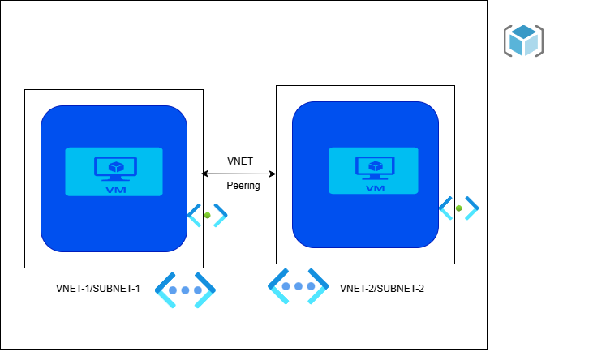

## Requirements

  

| Name | Version |
|------|---------|
|  [terraform](#requirement\_terraform) | >= 1.9.0 |
|  [azurerm](#requirement\_azurerm) | ~> 4.35.0 |

## Providers

| Name | Version |
|------|---------|
|  [azurerm](#provider\_azurerm) | 4.35.0 |

## Modules

No modules.

## Resources

| Name | Type |
|------|------|
| [azurerm_linux_virtual_machine.this](https://registry.terraform.io/providers/hashicorp/azurerm/latest/docs/resources/linux_virtual_machine) | resource |
| [azurerm_network_interface.this](https://registry.terraform.io/providers/hashicorp/azurerm/latest/docs/resources/network_interface) | resource |
| [azurerm_network_security_group.this](https://registry.terraform.io/providers/hashicorp/azurerm/latest/docs/resources/network_security_group) | resource |
| [azurerm_network_security_rule.this](https://registry.terraform.io/providers/hashicorp/azurerm/latest/docs/resources/network_security_rule) | resource |
| [azurerm_resource_group.this](https://registry.terraform.io/providers/hashicorp/azurerm/latest/docs/resources/resource_group) | resource |
| [azurerm_subnet.this](https://registry.terraform.io/providers/hashicorp/azurerm/latest/docs/resources/subnet) | resource |
| [azurerm_subnet_network_security_group_association.this](https://registry.terraform.io/providers/hashicorp/azurerm/latest/docs/resources/subnet_network_security_group_association) | resource |
| [azurerm_virtual_network.this](https://registry.terraform.io/providers/hashicorp/azurerm/latest/docs/resources/virtual_network) | resource |
| [azurerm_virtual_network_peering.this](https://registry.terraform.io/providers/hashicorp/azurerm/latest/docs/resources/virtual_network_peering) | resource |

## Inputs

| Name | Description | Type | Default | Required |
|------|-------------|------|---------|:--------:|
|  [rg\_location](#input\_rg\_location) | Location for the resource group | `string` | `"southindia"` | no |
|  [rg\_name](#input\_rg\_name) | Name of the resource group | `string` | `"PeeringRG"` | no |
|  [vnet\_config](#input\_vnet\_config) | Configuration for VNets and Subnets | <pre>map(object({     name            = string     address_space   = list(string)     subnet_name     = string     subnet_prefixes = list(string)   }))</pre> | <pre>{   "Vnet1": {     "address_space": [       "10.0.0.0/16"     ],     "name": "VNET1",     "subnet_name": "subnet1",     "subnet_prefixes": [       "10.0.1.0/24"     ]   },   "Vnet2": {     "address_space": [       "192.168.0.0/16"     ],     "name": "VNET2",     "subnet_name": "subnet2",     "subnet_prefixes": [       "192.168.1.0/24"     ]   } }</pre> | no |

## Outputs

No outputs.

